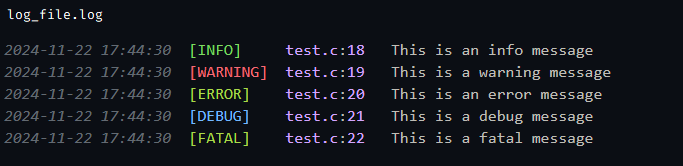
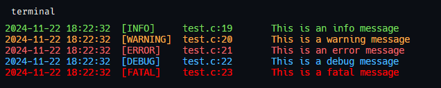

# logging C





## Config

- level - set a filter for the output of messages
- filename - file for write logs
- format - log format

## Levels

- ALL
- INFO
- ERROR
- WARN
- DEBUG
- FATAL

## Format

``` c
"%(time)\t[%(level)] \t%(filename):%(line)\t%(message)\n"
```

## Functions

### prints

- log_info
- log_warning
- log_error
- log_debug
- log_fatal

### Other

- set_def_cfg - устанавливает глобальный config
- get_datetime - возвращает дату и время в определенном формате (1, 2, 3, 4) / по умолчанию: 3
- get_def_cfg - возвращает указатель на def_config
- set_filename - устанавливает название файла в def_config для записи логов
- set_format - устанавливает определенное форматирование в def_config для логов
- set_level - устанавливает level в def_config

## Example

```c
#include <stdio.h>
#include "logger.h"

int main()
{
     Config newConfig = { "new_log.log", "%(level): %(message)\n", ALL };

    const char* info_message = "This is an info message";
    const char* warning_message = "This is a warning message";
    const char* error_message = "This is an error message";
    const char* debug_message = "This is a debug message";
    const char* fatal_message = "This is a fatal message";


    log_info(info_message);
    log_warning(warning_message);
    log_error(error_message);
    log_debug(debug_message);
    log_fatal(fatal_message);

    set_def_cfg(&newConfig);

    log_info(info_message);
    log_warning(warning_message);
    log_error(error_message);
    log_debug(debug_message);
    log_fatal(fatal_message);

    return 0;
}

```
